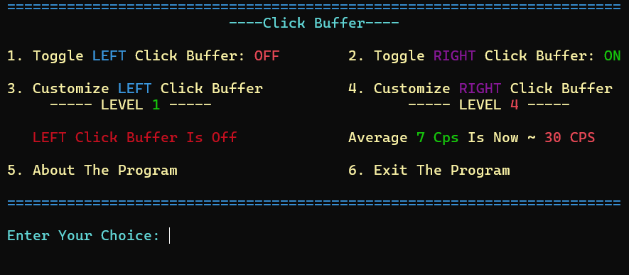

# Click-Buffer-In-C
Are you tired of clicking fast? your mouse is so bad that you can't click fast? click faster with click buffer!

Written in C.

Features:
Adjustable click buffer rate.

How it works:
The program detects if you are clicking fast to buffer the clicking output so you can still do your normal job fine even when the program is on.

How to Use
Just run ClickBuffer.exe. A terminal window will open showing the menu. Use the number keys to select options and toggle the buffer.
Also for anyone Running this from VScode remember to include the VScode file to make sure the output is in CMD and not VScode built in terminal.

Download
You can download the latest .exe from the Releases tab.

License
MIT License — do whatever you want with it.